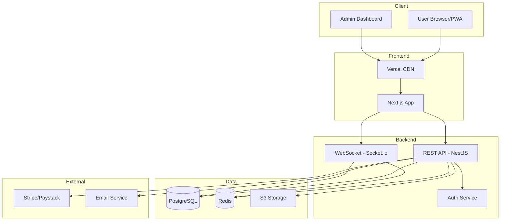

# Flex Bizz — System Architecture

> Technical blueprint for the Flex Bizz social e-commerce platform. This document outlines the technology stack, system components, and communication patterns.

---

## 1. High-Level Overview

Flex Bizz is a **three-tier social e-commerce platform** that combines marketplace functionality with social networking features.

### Architecture Layers

**Presentation Layer**
- Next.js PWA with server-side rendering
- Responsive mobile-first design
- Real-time UI updates via WebSocket

**Application Layer**
- RESTful API for core business logic
- WebSocket server for real-time features
- Authentication and authorization services

**Data Layer**
- PostgreSQL for relational data
- Redis for caching and sessions
- S3 for media storage

---

## 2. Technology Stack

### Frontend
- **Next.js 14+** - React framework with SSR/SSG for SEO
- **TypeScript** - Type safety and better DX
- **Tailwind CSS** - Utility-first styling
- **React Query** - Data fetching and caching
- **Socket.io Client** - Real-time messaging

### Backend
- **Node.js + NestJS** - Structured, scalable backend framework
- **TypeScript** - End-to-end type safety
- **Socket.io** - WebSocket server for real-time features
- **Passport.js + JWT** - Authentication and authorization
- **Prisma ORM** - Type-safe database access

### Database & Infrastructure
- **PostgreSQL** - Primary relational database
- **Redis** - Caching, sessions, pub/sub
- **AWS S3** - Media file storage
- **Stripe/Paystack** - Payment processing

### DevOps
- **Vercel** - Frontend hosting and CDN
- **Render/Railway** - Backend hosting
- **GitHub Actions** - CI/CD pipeline
- **Docker** - Containerization

---

## 3. System Architecture Diagram


---

## 4. Core Components

### 4.1 Frontend (Next.js)

**Responsibilities:**
- Server-side rendering for SEO
- Client-side navigation and routing
- Real-time updates via WebSocket
- Form handling and validation
- Image optimization

**Key Pages:**
- Product listings and search
- Product detail pages
- User profiles and stores
- Shopping cart and checkout
- Chat messaging interface
- Admin dashboard

---

### 4.2 Backend API (NestJS)

**Key Modules:**

**Auth Module**
- User registration and login
- JWT token generation
- Password reset and email verification

**User Module**
- Profile management
- Follow/unfollow users
- User product listings

**Product Module**
- CRUD operations for products
- Product search and filtering
- Product likes and views tracking

**Order Module**
- Order creation and management
- Order status updates
- Order history

**Payment Module**
- Payment initialization
- Webhook handling
- Transaction records

**Chat Module**
- Message sending and receiving
- Conversation management
- Unread message tracking

---

### 4.3 WebSocket Server

**Real-Time Features:**
- Direct messaging between users
- Live notifications (likes, follows, orders)
- Typing indicators
- Online status
- Live product updates

**Events:**
- `chat:message` - Send/receive messages
- `notification:new` - Push notifications
- `product:liked` - Real-time like updates
- `order:status` - Order status changes

---

### 4.4 Database Schema

**Core Tables:**
```
users
- id, username, email, password_hash
- display_name, bio, avatar_url
- is_verified, is_seller
- created_at, updated_at

products
- id, seller_id, title, description
- price, category, condition
- stock_quantity, images, tags
- status, views_count, likes_count
- created_at, updated_at

orders
- id, buyer_id, seller_id, product_id
- quantity, total_amount
- status, payment_status
- shipping_address
- created_at, updated_at

messages
- id, conversation_id, sender_id
- content, is_read
- created_at

conversations
- id, participant_1, participant_2
- last_message_at, created_at

follows
- follower_id, following_id
- created_at

likes
- user_id, product_id
- created_at
```

---

## 5. Data Flow Examples

### User Registration
```
1. User submits form → Frontend
2. POST /auth/register → Backend API
3. Validate and hash password → bcrypt
4. Create user record → PostgreSQL
5. Send verification email → Email Service
6. Return JWT token → Frontend
7. Store token in httpOnly cookie
```

### Product Purchase
```
1. User clicks "Buy Now" → Frontend
2. POST /orders → Backend API
3. Check product availability → PostgreSQL
4. Create pending order → PostgreSQL
5. Initiate payment → Stripe/Paystack
6. User completes payment
7. Webhook received → Backend
8. Update order status → PostgreSQL
9. Send notifications → WebSocket & Email
```

### Real-Time Chat
```
1. Establish WebSocket connection → Socket.io
2. User sends message → Frontend
3. Emit chat:message event → Socket.io Server
4. Save message → PostgreSQL
5. Broadcast to recipient → Socket.io Client
6. Display message → Frontend
7. Emit read receipt → Socket.io
```

---

## 6. Security Measures

**Authentication**
- JWT with short expiration (15 min access token)
- HTTP-only cookies prevent XSS
- Refresh token rotation
- Email verification for sellers

**Data Protection**
- HTTPS/TLS encryption
- Bcrypt password hashing (cost: 12)
- Input validation on all endpoints
- SQL injection prevention via Prisma
- CORS configuration

**Rate Limiting**
- 100 requests/min per user (general)
- 10 requests/min (auth endpoints)
- 5 requests/min (payments)

---

## 7. Scalability Strategy

**Performance Optimization**
- Redis caching for hot data
- CDN for static assets
- Database indexing on key columns
- API response caching
- Image optimization via CDN

**Horizontal Scaling**
- Stateless API design
- Load balancer for multiple instances
- Database connection pooling
- WebSocket sticky sessions

**Monitoring**
- Application logging (Winston/Pino)
- Error tracking (Sentry)
- Performance monitoring
- Database query analysis

---

## 8. Deployment Pipeline

**Development**
- Local Docker Compose setup
- Hot reloading enabled
- Seeded test data

**Staging**
- Auto-deploy from `develop` branch
- Integration testing
- Separate database instance

**Production**
- Manual approval required
- Zero-downtime deployments
- Automated rollback on failure
- Health checks and monitoring

**CI/CD Steps:**
```
1. Code push to GitHub
2. Run linters (ESLint, Prettier)
3. Run tests (Jest, Supertest)
4. Build Docker images
5. Deploy to staging
6. Run smoke tests
7. Deploy to production (manual)
```

---

## 9. Why This Architecture Works

**Proven Technologies**
- Next.js and NestJS are production-ready
- PostgreSQL handles high transaction volumes
- Socket.io powers major real-time applications

**Cost-Effective**
- Free tier options for MVP (Vercel, Render)
- Managed services reduce DevOps overhead
- Pay-as-you-grow pricing model

**Developer-Friendly**
- TypeScript reduces bugs
- Strong ecosystem and community
- Fast iteration and prototyping
- Clear separation of concerns

**Scalable**
- Can start simple and grow incrementally
- Clear path to microservices if needed
- Caching reduces database load
- CDN handles traffic spikes

---

## 10. Future Enhancements

**Phase 2**
- Advanced search with Elasticsearch
- Background job processing
- Image processing pipeline
- GraphQL API for mobile apps

**Phase 3**
- Microservices architecture
- Event-driven system (Kafka/RabbitMQ)
- ML-based recommendations
- Multi-currency and i18n support

--- 
