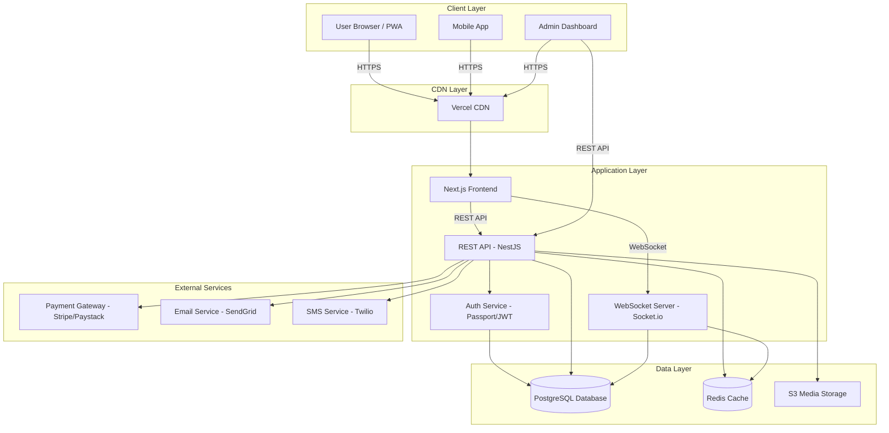

```markdown
# Flex Bizz — System Architecture

> **Technical blueprint** for the Flex Bizz social e-commerce platform. This document outlines the technology stack, system components, data architecture, and communication patterns that power the platform.

---

## 1. High-Level Overview

Flex Bizz is architected as a **modern, scalable three-tier application** designed to handle social interactions, e-commerce transactions, and real-time messaging simultaneously.

### Architecture Layers

**Presentation Layer (Frontend)**
- Progressive Web App (PWA) built with Next.js
- Server-side rendering (SSR) for optimal SEO and initial load performance
- Responsive design for mobile-first experience

**Application Layer (Backend)**
- RESTful API services for CRUD operations
- WebSocket connections for real-time features (chat, notifications)
- Authentication and authorization middleware
- Business logic and data validation

**Data Layer (Persistence)**
- PostgreSQL for structured, relational data
- Redis for caching, session management, and pub/sub messaging
- S3-compatible storage for media assets (images, videos)

---

## 2. Technology Stack

### Frontend Technologies
| Technology | Purpose | Justification |
|-----------|---------|---------------|
| **Next.js 14+** | React framework | SSR/SSG for SEO, API routes, optimized performance |
| **TypeScript** | Type safety | Reduces runtime errors, better developer experience |
| **Tailwind CSS** | Styling | Rapid UI development, consistent design system |
| **Satoshi Font** | Typography | Modern, professional brand identity |
| **React Query / SWR** | Data fetching | Smart caching, automatic refetching, optimistic updates |
| **Socket.io Client** | Real-time comms | Bi-directional messaging for chat and notifications |
| **Zustand / Redux** | State management | Centralized state for complex UI interactions |

### Backend Technologies
| Technology | Purpose | Justification |
|-----------|---------|---------------|
| **Node.js 20+** | Runtime | Non-blocking I/O, JavaScript ecosystem consistency |
| **NestJS** | Framework | Structured architecture, built-in TypeScript, scalable |
| **TypeScript** | Type safety | End-to-end type safety with frontend |
| **Socket.io** | WebSockets | Real-time messaging, notifications, live updates |
| **Passport.js** | Authentication | Flexible auth strategies (local, OAuth, JWT) |
| **JWT** | Token management | Stateless authentication, secure API access |
| **Bcrypt** | Password hashing | Industry-standard password security |

### Database & Infrastructure
| Technology | Purpose | Justification |
|-----------|---------|---------------|
| **PostgreSQL 15+** | Primary database | ACID compliance, complex queries, relations |
| **Prisma ORM** | Database toolkit | Type-safe queries, migrations, easy schema management |
| **Redis 7+** | Cache & pub/sub | Fast data access, session storage, real-time events |
| **AWS S3 / Cloudinary** | Media storage | Scalable file hosting, image optimization, CDN |
| **Stripe / Paystack** | Payment processing | Secure payment gateway, subscription management |

### DevOps & Deployment
| Technology | Purpose | Justification |
|-----------|---------|---------------|
| **Vercel** | Frontend hosting | Optimized for Next.js, global CDN, zero-config |
| **Render / Railway** | Backend hosting | Easy deployment, auto-scaling, PostgreSQL included |
| **Docker** | Containerization | Consistent environments across development and production |
| **GitHub Actions** | CI/CD | Automated testing, building, and deployment |
| **Jest & Supertest** | Testing | Unit and integration testing for reliability |

---

## 3. System Architecture Diagram



---

## 4. Component Details

### 4.1 Frontend (Next.js)

**Responsibilities:**
- Render dynamic product pages with SEO optimization
- Handle user interactions and form submissions
- Manage client-side routing and navigation
- Display real-time updates via WebSocket connections
- Implement responsive design for all screen sizes

**Key Features:**
- Server-side rendering for product listings and search results
- Static generation for content pages (About, Terms, etc.)
- Image optimization with Next.js Image component
- Progressive Web App capabilities (offline support, installable)
- Code splitting for optimal bundle sizes

**Folder Structure:**
```
/app
  /products
  /profile
  /cart
  /checkout
/components
  /ui
  /features
/lib
  /api
  /hooks
/public
/styles
```

---

### 4.2 Backend API (NestJS)

**Responsibilities:**
- Expose RESTful endpoints for CRUD operations
- Validate and sanitize incoming requests
- Enforce authentication and authorization
- Process business logic
- Integrate with external services (payments, notifications)

**API Modules:**

**Authentication Module**
- `POST /auth/register` - User registration
- `POST /auth/login` - User login (returns JWT)
- `POST /auth/logout` - Invalidate session
- `POST /auth/refresh` - Refresh access token
- `GET /auth/profile` - Get current user profile

**User Module**
- `GET /users/:id` - Get user profile
- `PATCH /users/:id` - Update user profile
- `GET /users/:id/products` - Get user's products
- `GET /users/:id/followers` - Get followers list
- `POST /users/:id/follow` - Follow a user

**Product Module**
- `GET /products` - List products (with filters, pagination)
- `GET /products/:id` - Get single product details
- `POST /products` - Create new product
- `PATCH /products/:id` - Update product
- `DELETE /products/:id` - Delete product
- `POST /products/:id/like` - Like/unlike product

**Order Module**
- `GET /orders` - List user orders
- `GET /orders/:id` - Get order details
- `POST /orders` - Create new order
- `PATCH /orders/:id/status` - Update order status (seller/admin)
- `POST /orders/:id/cancel` - Cancel order

**Payment Module**
- `POST /payments/initiate` - Initialize payment
- `POST /payments/webhook` - Handle payment provider webhooks
- `GET /payments/:id` - Get payment status

**Search Module**
- `GET /search` - Full-text search across products
- `GET /search/suggestions` - Autocomplete suggestions

**Admin Module**
- `GET /admin/users` - List all users
- `PATCH /admin/users/:id/status` - Ban/unban user
- `GET /admin/analytics` - Platform analytics
- `GET /admin/reports` - User reports and moderation queue

---

### 4.3 WebSocket Server (Socket.io)

**Responsibilities:**
- Manage real-time connections
- Handle chat messaging between users
- Push notifications to connected clients
- Broadcast live updates (new followers, likes, orders)

**Events:**

**Chat Events:**
- `chat:join` - Join a conversation room
- `chat:message` - Send a message
- `chat:typing` - Indicate typing status
- `chat:read` - Mark messages as read

**Notification Events:**
- `notification:new` - Push new notification to user
- `notification:read` - Mark notification as read

**Activity Events:**
- `product:liked` - Product received a new like
- `order:status` - Order status changed
- `user:followed` - New follower notification

---

### 4.4 Database Schema (PostgreSQL)

**Core Tables:**

**users**
```sql
id              UUID PRIMARY KEY
username        VARCHAR(50) UNIQUE NOT NULL
email           VARCHAR(255) UNIQUE NOT NULL
password_hash   VARCHAR(255) NOT NULL
display_name    VARCHAR(100)
bio             TEXT
avatar_url      VARCHAR(500)
phone           VARCHAR(20)
is_verified     BOOLEAN DEFAULT FALSE
is_seller       BOOLEAN DEFAULT FALSE
created_at      TIMESTAMP DEFAULT NOW()
updated_at      TIMESTAMP DEFAULT NOW()
```

**products**
```sql
id              UUID PRIMARY KEY
seller_id       UUID REFERENCES users(id)
title           VARCHAR(200) NOT NULL
description     TEXT
price           DECIMAL(10,2) NOT NULL
category        VARCHAR(50)
condition       VARCHAR(20)
stock_quantity  INTEGER DEFAULT 1
images          JSONB
tags            VARCHAR(50)[]
status          VARCHAR(20) DEFAULT 'active'
views_count     INTEGER DEFAULT 0
likes_count     INTEGER DEFAULT 0
created_at      TIMESTAMP DEFAULT NOW()
updated_at      TIMESTAMP DEFAULT NOW()
```

**orders**
```sql
id              UUID PRIMARY KEY
buyer_id        UUID REFERENCES users(id)
seller_id       UUID REFERENCES users(id)
product_id      UUID REFERENCES products(id)
quantity        INTEGER NOT NULL
total_amount    DECIMAL(10,2) NOT NULL
status          VARCHAR(20) DEFAULT 'pending'
payment_status  VARCHAR(20) DEFAULT 'pending'
shipping_address JSONB
created_at      TIMESTAMP DEFAULT NOW()
updated_at      TIMESTAMP DEFAULT NOW()
```

**messages**
```sql
id              UUID PRIMARY KEY
conversation_id UUID REFERENCES conversations(id)
sender_id       UUID REFERENCES users(id)
content         TEXT NOT NULL
is_read         BOOLEAN DEFAULT FALSE
created_at      TIMESTAMP DEFAULT NOW()
```

**conversations**
```sql
id              UUID PRIMARY KEY
participant_1   UUID REFERENCES users(id)
participant_2   UUID REFERENCES users(id)
last_message_at TIMESTAMP
created_at      TIMESTAMP DEFAULT NOW()
```

**follows**
```sql
follower_id     UUID REFERENCES users(id)
following_id    UUID REFERENCES users(id)
created_at      TIMESTAMP DEFAULT NOW()
PRIMARY KEY (follower_id, following_id)
```

**likes**
```sql
user_id         UUID REFERENCES users(id)
product_id      UUID REFERENCES products(id)
created_at      TIMESTAMP DEFAULT NOW()
PRIMARY KEY (user_id, product_id)
```

---

### 4.5 Caching Strategy (Redis)

**Use Cases:**
- **Session storage:** User sessions and JWT blacklist
- **Hot data caching:** Frequently accessed products, user profiles
- **Rate limiting:** API request throttling per user
- **Pub/Sub:** Real-time event broadcasting to WebSocket clients
- **Temporary data:** OTP codes, password reset tokens

**Key Patterns:**
```
user:session:{userId}           - User session data (TTL: 7 days)
user:profile:{userId}           - Cached user profile (TTL: 1 hour)
product:{productId}             - Cached product details (TTL: 30 min)
trending:products               - List of trending products (TTL: 15 min)
ratelimit:{userId}:{endpoint}   - API rate limit counters (TTL: 1 min)
otp:{email}                     - Email verification codes (TTL: 10 min)
```

---

## 5. Data Flow Examples

### 5.1 User Registration Flow

```
1. User submits registration form → Frontend
2. Frontend sends POST /auth/register → Backend API
3. Backend validates data, checks for duplicates → PostgreSQL
4. Backend hashes password with bcrypt
5. Backend creates user record → PostgreSQL
6. Backend sends verification email → Email Service
7. Backend returns JWT token → Frontend
8. Frontend stores token in httpOnly cookie
9. Frontend redirects to dashboard
```

### 5.2 Product Purchase Flow

```
1. User clicks "Buy Now" → Frontend
2. Frontend sends POST /orders → Backend API
3. Backend validates product availability → PostgreSQL
4. Backend creates pending order → PostgreSQL
5. Backend initiates payment → Stripe/Paystack
6. Payment provider redirects user to payment page
7. User completes payment
8. Payment provider sends webhook → Backend
9. Backend updates order status → PostgreSQL
10. Backend sends confirmation email → Email Service
11. Backend notifies seller via WebSocket → Socket.io
12. Frontend updates UI to show order confirmation
```

### 5.3 Real-Time Chat Flow

```
1. User opens chat with seller → Frontend
2. Frontend establishes WebSocket connection → Socket.io
3. User types message → Frontend
4. Frontend emits chat:message event → Socket.io
5. Socket.io stores message → PostgreSQL
6. Socket.io broadcasts message to recipient → Socket.io Client
7. Recipient's frontend displays message
8. Recipient's frontend emits chat:read event
9. Socket.io updates message status → PostgreSQL
```

---

## 6. Security Considerations

### Authentication & Authorization
- JWT tokens with short expiration (15 min access, 7 days refresh)
- HTTP-only cookies to prevent XSS attacks
- Refresh token rotation on each use
- Role-based access control (RBAC) for admin features
- Email verification required for sellers

### Data Protection
- HTTPS/TLS encryption for all communications
- Password hashing with bcrypt (cost factor: 12)
- Input validation and sanitization on all endpoints
- SQL injection prevention via Prisma ORM parameterized queries
- CORS configuration to allow only trusted origins

### Rate Limiting
- 100 requests per minute per user for general endpoints
- 10 requests per minute for authentication endpoints
- 5 requests per minute for payment initiation
- IP-based rate limiting for public endpoints

### File Upload Security
- File type validation (images only: jpg, png, webp)
- File size limits (5MB per image, max 5 images per product)
- Virus scanning for uploaded files
- Signed URLs for private media access

---

## 7. Scalability & Performance

### Horizontal Scaling
- Stateless API design allows multiple backend instances
- Load balancer distributes traffic across instances
- WebSocket sticky sessions for connection persistence
- Database connection pooling (max 20 connections per instance)

### Caching Strategy
- Redis caching reduces database load by 60-70%
- CDN caching for static assets (images, CSS, JS)
- Browser caching with appropriate cache headers
- API response caching for read-heavy endpoints

### Database Optimization
- Indexes on frequently queried columns (username, email, product category)
- Pagination for all list endpoints (limit: 20 items per page)
- Database query optimization with EXPLAIN ANALYZE
- Prepared statements for repeated queries

### Monitoring & Observability
- Application logging with Winston or Pino
- Error tracking with Sentry
- Performance monitoring with New Relic or Datadog
- Database query monitoring with pg_stat_statements
- Uptime monitoring with Pingdom or UptimeRobot

---

## 8. Deployment Strategy

### Development Environment
- Local development with Docker Compose
- Hot reloading for frontend and backend
- Seeded database with test data
- Environment variables in `.env.local`

### Staging Environment
- Deployed on Vercel (frontend) and Render (backend)
- Separate database instance for testing
- Automated deployments on push to `develop` branch
- Integration testing before production release

### Production Environment
- Frontend: Vercel with automatic scaling
- Backend: Render or AWS ECS with load balancing
- Database: Managed PostgreSQL (AWS RDS, Render, or Supabase)
- Redis: Managed Redis (Upstash or Redis Cloud)
- Storage: AWS S3 with CloudFront CDN

### CI/CD Pipeline (GitHub Actions)
```yaml
1. Code push to repository
2. Run linter (ESLint, Prettier)
3. Run unit tests (Jest)
4. Run integration tests (Supertest)
5. Build Docker images
6. Push images to registry
7. Deploy to staging
8. Run smoke tests
9. Deploy to production (manual approval required)
```

---

## 9. Technical Feasibility

### Why This Architecture Works

**Proven Technology Stack**
- Next.js and NestJS are battle-tested frameworks used by Fortune 500 companies
- PostgreSQL handles millions of transactions per day in production systems
- Socket.io powers real-time features in Slack, Microsoft, and other major platforms

**Developer Experience**
- TypeScript across the stack reduces integration bugs
- Shared data types between frontend and backend
- Extensive documentation and community support
- Rich ecosystem of libraries and tools

**Cost-Effective**
- Vercel free tier supports up to 100GB bandwidth
- Render free tier for MVP development
- Managed database services start at $5-10/month
- Pay-as-you-grow model for all services

**Rapid Development**
- ORM (Prisma) accelerates database operations
- Next.js API routes for quick prototyping
- Pre-built authentication strategies with Passport.js
- Component libraries (shadcn/ui) for fast UI development

**Scalability Path**
- Can start with a monolith and split into microservices later
- Database can be scaled vertically initially, then horizontally with read replicas
- CDN and caching reduce server load significantly
- WebSocket server can be separated as traffic grows

---

## 10. Future Enhancements

### Phase 2 Features
- Elasticsearch for advanced product search
- Redis pub/sub for distributed WebSocket messaging
- Background job processing with Bull Queue
- Image processing pipeline with Sharp or Cloudinary
- GraphQL API for mobile apps

### Phase 3 Features
- Microservices architecture (separate services for auth, products, orders)
- Event-driven architecture with Kafka or RabbitMQ
- Machine learning recommendations
- Multi-currency support
- Internationalization (i18n) for multiple languages

---

## 11. Conclusion

This architecture provides a **solid foundation** for Flex Bizz to launch as an MVP while maintaining a **clear path to scale**. The technology choices balance developer productivity, performance, and cost-effectiveness.

**Key Strengths:**
- Modern, maintainable codebase
- Real-time capabilities for social features
- Secure authentication and payment processing
- Optimized for SEO and user experience
- Ready for rapid iteration and growth

**Next Steps:**
1. Set up development environment
2. Initialize Git repository with project structure
3. Configure CI/CD pipeline
4. Implement authentication module
5. Build product listing and search features
6. Integrate payment gateway
7. Deploy MVP to staging

---

**Document Version:** 1.0  
**Last Updated:** November 10, 2025  
**Author:** Flex Bizz Development Team
```
